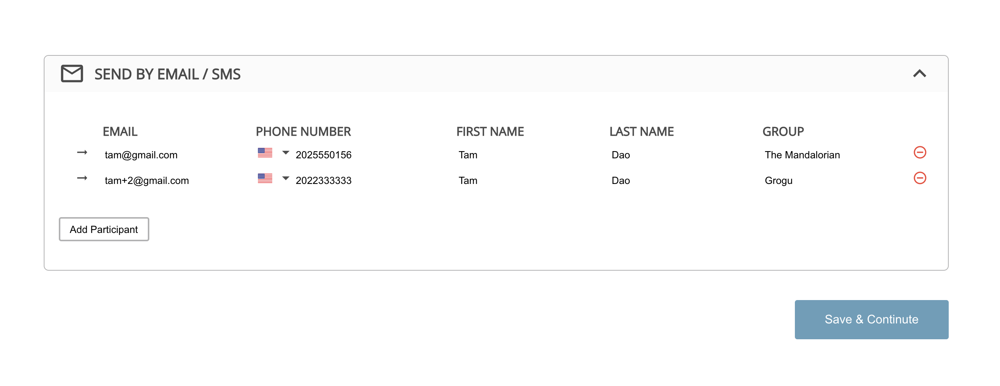

# SurveySaurus | Take-Home Test

## Mission summary (features + bonus)

- **Add Participants**

  - Email: validation, unique and hover feature
  - Phone number: validation, validate the phone number based on the selected country and hover feature
  - First name
  - Last name
  - Group: input and dropdown

- **Delete Participants**
- **Save Participants**
  - Save manually: display confirm modal
  - Auto-save

## Available Scripts

In the project directory, you can run:

### `yarn start`

Runs the app in the development mode.\
Open [http://localhost:3000](http://localhost:3000) to view it in the browser.

The page will reload if you make edits.\
You will also see any lint errors in the console.
